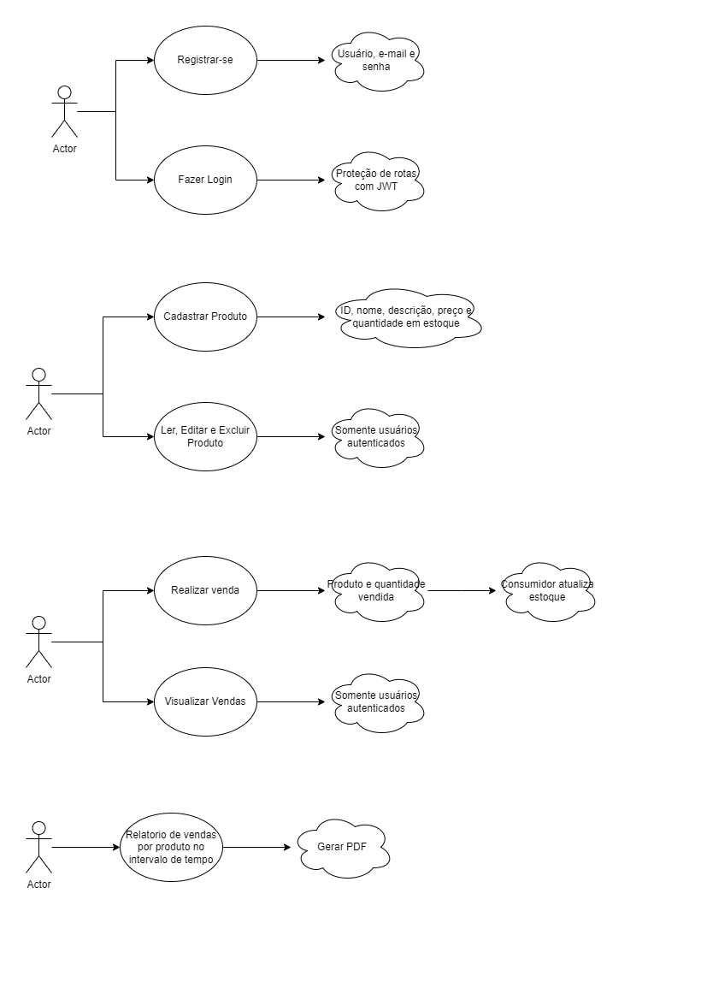

# Objetivos

Desafio para treinar conhecimentos em dotnet back-end, iniciar estudos em React front-end e usar mensageria com RabbitMQ e MassTransit:

Você deve construir um sistema de gerenciamento de vendas de produtos online com recursos adicionais para geração de relatórios gerenciais em PDF. O sistema deve ter autenticação de usuários, CRUD de produtos e gerenciamento de vendas, bem como a capacidade de gerar relatórios gerenciais em PDF.

Aqui estão os casos de uso do sistema:

1. Autenticação:
    - O usuário deve ser capaz de se cadastrar no sistema com nome de usuário, e-mail e senha.
    - O usuário deve ser capaz de fazer login no sistema usando seu nome de usuário e senha.

2. CRUD de produtos:
    - O usuário autenticado deve ser capaz de criar, ler, atualizar e excluir produtos.
    - Os dados de produto devem incluir um ID, nome, descrição, preço e quantidade em estoque.

3. Gerenciamento de vendas:
    - O usuário autenticado deve ser capaz de ver uma lista de todas as vendas concluídas.
    - O usuário autenticado deve ser capaz de registrar uma nova venda com informações do produto vendido e a quantidade vendida.
    - Quando uma venda é registrada, uma mensagem deve ser enviada para uma fila RabbitMQ usando MassTransit.
    - O consumidor de mensagens da fila deve ser responsável por atualizar o estoque de produtos vendidos.

4. Relatórios gerenciais em PDF:
    - O usuário autenticado deve ser capaz de gerar relatórios gerenciais em PDF que mostrem o total de vendas em um determinado período de tempo, o total de produtos vendidos e o total de vendas por produto.
    - Os relatórios gerados devem ser visualizáveis e imprimíveis em formato PDF.

Além desses casos de uso, você deve criar uma interface de usuário com React que permita que o usuário navegue no sistema, execute as ações necessárias e visualize as informações relevantes. Você também precisará aprender a gerar relatórios gerenciais em PDF usando uma biblioteca de geração de PDF em dotnet, como o iTextSharp.

Para completar o desafio, você precisará usar seus conhecimentos em dotnet back-end para criar uma API RESTful que gerencie os dados de usuário, produto e venda, bem como gere relatórios gerenciais em PDF. Você também precisará usar mensageria com RabbitMQ e MassTransit para atualizar o estoque de produtos e aprender a criar uma aplicação de front-end usando React para criar a interface do usuário do sistema.

